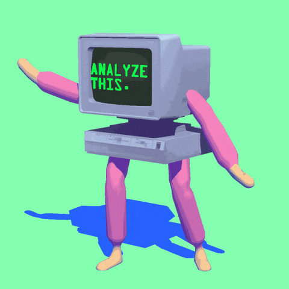
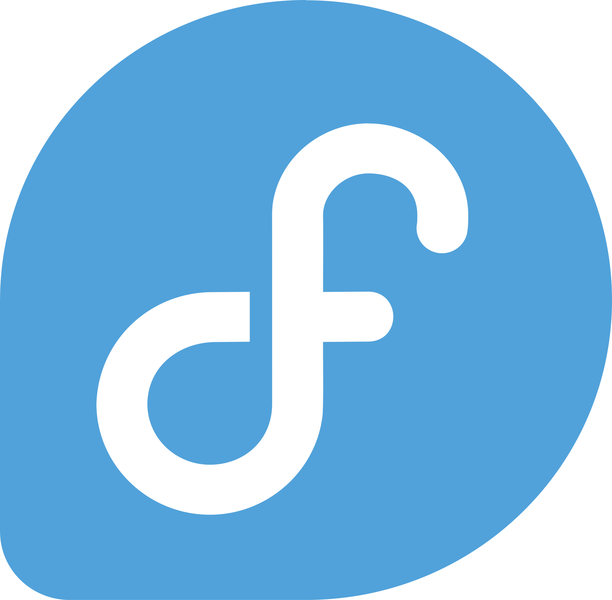
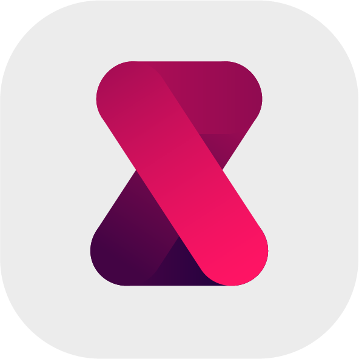

<h1 align="center">

Welcome to my Profile!

</h1>

   

 

<h1 align="center">👤 About Me 👤</h1>

  

<h3 align="center">
     Hi!, I'm Jetsada.  A Computer Engineer Student.
</h3>
🔭 I'm passionate about Web development, Bitcoin and Nostr.
  👨‍💻 I love to explore new technologies and learn new things.
  🌱 I'm currently learning Rust, Astro and Headless CMS.
  🚀 I’m currently working on Individual-project.

### 💬 Contact

- **Nostr**
  -  `awesome@nostr.13room.space` (NIP-05)
  -  `npub1l2apha3enhyuaxlzhaqw6cjfyzgtya3vdeckvlr002dsrnw2ckgq95vugy`
- **Website**
  - [kx53.cyou](https://kx53.cyou)
  - [13room.space](https://13room.space)

 

<h1 align="center">💿 Languages 🗿</h1>

    <table>
        <tr>
            <td align="center" width="98">
                
            </td>
            <td align="center" width="98">
                
            </td>
            <td align="center" width="98">
                
            </td>
            <td align="center" width="98">
                
            </td>
        </tr>
        <tr>
            <td align="center" width="98">C</td>
            <td align="center" width="98">C#</td>
            <td align="center" width="98">Swift</td>
            <td align="center" width="98">Rust</td>
        </tr>
        <tr>
            <td align="center" width="98">
                
            </td>
            <td align="center" width="98">
                
            </td>
            <td align="center" width="98">
                
            </td>
            <td align="center" width="98">
                
            </td>
        </tr>
        <tr>
            <td align="center" width="98">Python</td>
            <td align="center" width="98">JavaScript</td>
            <td align="center" width="98">TypeScript</td>
            <td align="center" width="98">Java</td>
        </tr>
    </table>

 
 

<h1 align="center">🌐 Web Developments 🚀</h1>

    <table>
        <tr>
            <td align="center" width="98">
                
            </td>
            <td align="center" width="98">
                
            </td>
            <td align="center" width="98">
                
            </td>
            <td align="center" width="98">
                
            </td>
        </tr>
        <tr>
            <td align="center" width="98">Astro</td>
            <td align="center" width="98">Vue.js</td>
            <td align="center" width="98">Tailwind</td>
            <td align="center" width="98">GSAP</td>
        </tr>
        <tr>
            <td align="center" width="98">
                
            </td>
            <td align="center" width="98">
                
            </td>
            <td align="center" width="98">
                
            </td>
            <td align="center" width="98">
                
            </td>
        </tr>
        <tr>
            <td align="center" width="98">DaisyUI</td>
            <td align="center" width="98">Next.js</td>
            <td align="center" width="98">shadcn/ui</td>
            <td align="center" width="98">Nuxt.js</td>
        </tr>
    </table>

 
 

<h1 align="center">🛠️ Tools 💻</h1>

    <table>
        <tr>
            <td align="center" width="98">
                
            </td>
            <td align="center" width="98">
                
            </td>
            <td align="center" width="98">
                
            </td>
            <td align="center" width="98">
                
            </td>
        </tr>
        <tr>
            <td align="center" width="98">VS Code</td>
            <td align="center" width="98">Linux</td>
            <td align="center" width="98">NixOS</td>
            <td align="center" width="98">Fedora</td>
        </tr>
        <tr>
            <td align="center" width="98">
                
            </td>
            <td align="center" width="98">
                
            </td>
            <td align="center" width="98">
                
            </td>
            <td align="center" width="98">
                
            </td>
        </tr>
        <tr>
            <td align="center" width="98">Git</td>
            <td align="center" width="98">Bash</td>
            <td align="center" width="98">Kitty</td>
            <td align="center" width="98">Cloudflare</td>
        </tr>
        <tr>
            <td align="center" width="98">
                
            </td>
            <td align="center" width="98">
                
            </td>
            <td align="center" width="98">
                
            </td>
            <td align="center" width="98">
                
            </td>
        </tr>
        <tr>
            <td align="center" width="98">Arduino IDE</td>
            <td align="center" width="98">Docker</td>
            <td align="center" width="98">RustRover</td>
            <td align="center" width="98">Supabase</td>
        </tr>
        <tr>
            <td align="center" width="98">
                
            </td>
            <td align="center" width="98">
                
            </td>
            <td align="center" width="98">
                
            </td>
            <td align="center" width="98">
                
            </td>
        </tr>
        <tr>
            <td align="center" width="98">Node.js</td>
            <td align="center" width="98">Bun</td>
            <td align="center" width="98">Vercel</td>
            <td align="center" width="98">Temurin</td>
        </tr>
    </table>

 
 

<h1 align="center">🗃️ Databases 🗄️</h1>

    <table>
        <tr>
            <td align="center" width="98">
                
            </td>
            <td align="center" width="98">
                
            </td>
            <td align="center" width="98">
                
            </td>
            <td align="center" width="98">
                
            </td>
        </tr>
        <tr>
            <td align="center" width="98">PostgreSQL</td>
            <td align="center" width="98">SQLite</td>
            <td align="center" width="98">MariaDB</td>
            <td align="center" width="98">MongoDB</td>
        </tr>
    </table>

 
 

<h1 align="center">📊 GitHub Status</h1>

  

  

    
    
   

